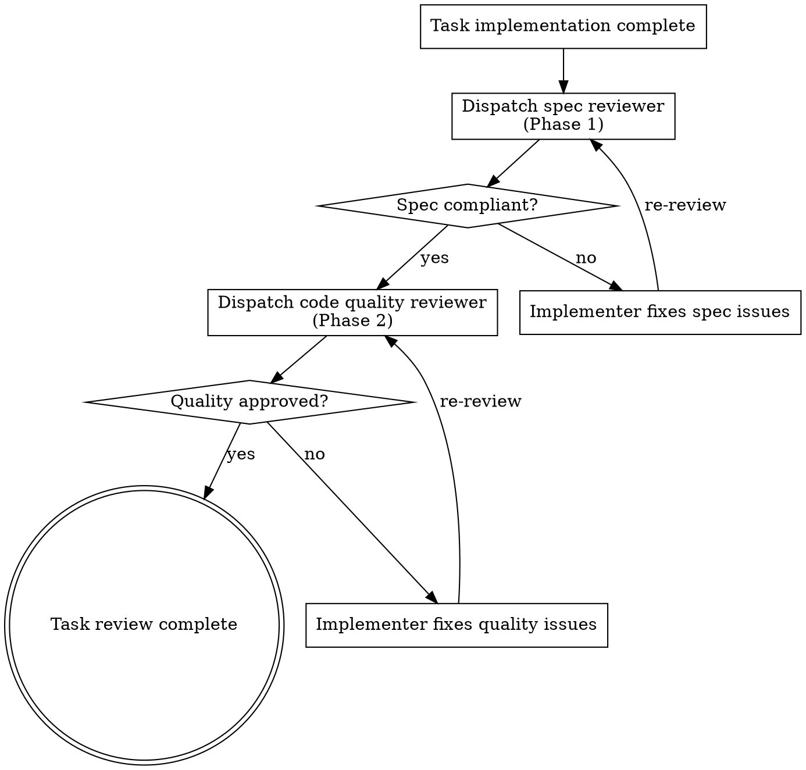

> **HARD GATE**: Spec compliance must pass before code quality review. Do NOT start code quality review until the spec reviewer has approved. Running them in parallel or out of order is forbidden.

# Two-Phase Review Routing

Orchestration for the two-phase review process used during specpower:build Phase B. Each task's implementation goes through spec compliance first, then code quality.

## Overview

Two sequential review phases ensure that code both matches the specification and meets quality standards. The order is non-negotiable: spec compliance first, code quality second.

**Why this order:** Code quality review on spec-noncompliant code is wasted effort. Fix what's wrong before polishing how it's built.

## Phase 1: Spec Compliance Review

**Prompt source:** Read `.claude/specpower/prompts/shared/spec-reviewer-prompt.md`

**Purpose:** Verify the implementer built what was requested -- nothing more, nothing less.

**Dispatch:**
```
Task tool (general-purpose):
  description: "Review spec compliance for Task N"
  prompt: [content from spec-reviewer-prompt.md with placeholders filled]
```

**Inputs to provide:**
- Full text of the task requirements (from the plan)
- Implementer's report of what they claim they built
- File paths of changed files

**Expected output:**
- Spec compliant (all requirements met, nothing extra)
- OR: Issues found (list of missing/extra/misunderstood items with file:line references)

**If issues found:**
1. Send issues back to the implementer subagent for fixes
2. Re-dispatch spec reviewer after fixes
3. Repeat until spec compliance passes
4. Only THEN proceed to Phase 2

## Phase 2: Code Quality Review

**Prompt source:** Read `.claude/specpower/prompts/shared/code-reviewer-prompt.md`

**Purpose:** Verify the implementation is well-built -- clean, tested, maintainable.

**Before dispatch: custom review rules are sync-baked (no runtime fill).**
Custom review rules are NOT read or filled by the controller at runtime — they
are baked into the reviewer prompt's `Custom Standards` placeholder at
`specpower init`/`sync` time by `bakeCustomIncludes` → `bakePrompts`. The
placeholder is already replaced with the concatenated contents of
`specpower/custom/review/` (or `none` if missing/empty). The controller just
reads the baked prompt and dispatches. (In a worktree, `phase-b-worktree.md`
setup runs `specpower sync` to regenerate the baked prompt.)

**D11 residue check (REQUIRED before dispatch):** if any
`specpower/custom/review/*.md` still contains an unresolved `!include`
directive line (previous bake did not complete / never run — fail-fast policy
leaves no `!include` lines on success), warn the user to run
`specpower sync` before proceeding. Do not silently proceed with stale/unbaked
rules.

**Dispatch:**
```
Task tool (general-purpose):
  description: "Review code quality for Task N"
  prompt: [content from code-reviewer-prompt.md with placeholders filled]
```

**Inputs to provide:**
- What was implemented (from implementer's report)
- Plan or requirements reference
- Base SHA and Head SHA for the git range
- Brief description

**Expected output:**
- Strengths, Issues (Critical/Important/Minor), Assessment
- Ready to merge verdict

**If issues found:**
1. Send issues back to the implementer subagent for fixes
2. Re-dispatch code quality reviewer after fixes
3. Repeat until approved

## Flow



## Red Flags

**Never:**
- Run code quality review before spec compliance passes
- Run both reviews in parallel
- Skip the re-review loop after fixes
- Accept "close enough" on spec compliance
- Let the implementer self-review replace either formal review

**Always:**
- Spec compliance first, code quality second
- Loop until each phase passes
- Provide full task context to each reviewer
- Wait for user confirmation after both phases pass
