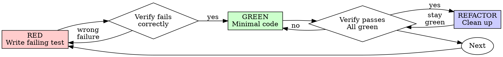

> **HARD GATE**: Test must FAIL before writing implementation. If you write production code before seeing a failing test, delete it and start over. No exceptions.

<!-- SOURCE: skills/test-driven-development/SKILL.md -->

# Test-Driven Development (Build Variant)

Per-task atomic TDD for the build phase. Each task in the plan follows Red-Green-Refactor strictly.

## Overview

Write the test first. Watch it fail. Write minimal code to pass.

**Core principle:** If you didn't watch the test fail, you don't know if it tests the right thing.

**Violating the letter of the rules is violating the spirit of the rules.**

## When to Use

**Always during build phase tasks:**
- Each task in the implementation plan
- Bug fixes discovered during implementation
- Behavior changes within a task

**Exceptions (ask your human partner):**
- Throwaway prototypes
- Generated code
- Configuration files

## The Iron Law

```
NO PRODUCTION CODE WITHOUT A FAILING TEST FIRST
```

Write code before the test? Delete it. Start over.

**No exceptions:**
- Don't keep it as "reference"
- Don't "adapt" it while writing tests
- Don't look at it
- Delete means delete

Implement fresh from tests. Period.

## Red-Green-Refactor



### RED - Write Failing Test

Write one minimal test showing what should happen.

**Requirements:**
- One behavior per test
- Clear, descriptive name
- Real code (no mocks unless unavoidable)

**Test classification — cover both positive and negative:**
- **Positive tests**: verify expected behavior with valid inputs — **including legitimate boundary values** (empty array, single element, extreme values, large inputs). These are positive because the input is within the function's accepted domain, even at its edge.
- **Negative tests**: verify handling of **abnormal / contract-violating** inputs:
  - Invalid inputs (wrong type, out-of-range, malformed) — contract violation
  - null / undefined **where the contract forbids them** — contract violation
  - Invalid state (operation before init, after close, in wrong phase)
  - Resource exhaustion to failure (timeout, disk full, connection refused)
- **Critical distinction**: "empty" / "boundary" / "large" inputs are negative **only if** they violate the contract or trigger abnormal handling. If the function accepts them as valid input, testing correct behavior there is **positive**. See `prompts/reference/specpower/negative-testing-guide.md`.
- **Target ratio**: ≥ 30% negative for functions with side effects / state / I/O; pure functions with strict contracts may naturally be lower (15-30%) — do NOT pad the ratio by reclassifying legitimate-boundary tests as negative.

### Verify RED - Watch It Fail

**MANDATORY. Never skip.**

```bash
<test-runner> path/to/test
```

Confirm:
- Test fails (not errors)
- Failure message is expected
- Fails because feature missing (not typos)

**Test passes?** You're testing existing behavior. Fix test.

**Test errors?** Fix error, re-run until it fails correctly.

### GREEN - Minimal Code

Write simplest code to pass the test. Don't add features, refactor other code, or "improve" beyond the test.

### Verify GREEN - Watch It Pass

**MANDATORY.**

Confirm:
- Test passes
- Other tests still pass
- Output pristine (no errors, warnings)

**Test fails?** Fix code, not test.

**Other tests fail?** Fix now.

### REFACTOR - Clean Up

After green only:
- Remove duplication
- Improve names
- Extract helpers

Keep tests green. Don't add behavior.

### Repeat

Next failing test for next behavior in the task.

## Per-Task Commit Pattern

Each task in the plan should follow this atomic cycle:

1. Write failing test for first behavior -> verify RED
2. Write minimal implementation -> verify GREEN
3. Refactor if needed -> verify still GREEN
4. Repeat for remaining behaviors in the task
5. Commit all changes for the task

## Red Flags - STOP and Start Over

- Code before test
- Test after implementation
- Test passes immediately
- Can't explain why test failed
- Tests added "later"
- Rationalizing "just this once"

**All of these mean: Delete code. Start over with TDD.**

## Verification Checklist (Per Task)

Before marking a task complete:

- [ ] Every new function/method has a test
- [ ] Watched each test fail before implementing
- [ ] Each test failed for expected reason (feature missing, not typo)
- [ ] Wrote minimal code to pass each test
- [ ] All tests pass
- [ ] Output pristine (no errors, warnings)
- [ ] Tests use real code (mocks only if unavoidable)
- [ ] Edge cases and errors covered
- [ ] Negative test cases cover all contract-violating inputs (null where forbidden, wrong type, invalid state); legitimate-boundary tests (empty/extreme/large) are counted as positive, not negative

## Common Rationalizations

| Excuse | Reality |
|--------|---------|
| "Too simple to test" | Simple code breaks. Test takes 30 seconds. |
| "I'll test after" | Tests passing immediately prove nothing. |
| "Need to explore first" | Fine. Throw away exploration, start with TDD. |
| "Test hard = design unclear" | Listen to test. Hard to test = hard to use. |

## When Stuck

| Problem | Solution |
|---------|----------|
| Don't know how to test | Write wished-for API. Write assertion first. |
| Test too complicated | Design too complicated. Simplify interface. |
| Must mock everything | Code too coupled. Use dependency injection. |
| Test setup huge | Extract helpers. Still complex? Simplify design. |

## Final Rule

```
Production code -> test exists and failed first
Otherwise -> not TDD
```

No exceptions without your human partner's permission.
