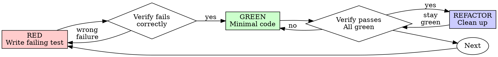

> **HARD GATE**: Test must FAIL before writing implementation. If you write production code before seeing a failing test, delete it and start over. No exceptions.

<!-- SOURCE: skills/test-driven-development/SKILL.md -->

# Test-Driven Development (Standalone Test Suite Variant)

Full-suite multi-level testing: unit, integration, E2E, and regression. Use this for comprehensive test coverage across an entire codebase or feature area.

## Overview

Write the test first. Watch it fail. Write minimal code to pass.

**Core principle:** If you didn't watch the test fail, you don't know if it tests the right thing.

**Violating the letter of the rules is violating the spirit of the rules.**

## When to Use

**Standalone testing scenarios:**
- Building out a complete test suite for new or existing code
- Adding multi-level test coverage (unit + integration + E2E)
- Regression testing after bug fixes
- Pre-release verification testing
- Migrating or upgrading with test safety nets

## The Iron Law

```
NO PRODUCTION CODE WITHOUT A FAILING TEST FIRST
```

Write code before the test? Delete it. Start over.

## Red-Green-Refactor



### RED - Write Failing Test

Write one minimal test showing what should happen.

**Requirements:**
- One behavior per test
- Clear, descriptive name
- Real code (no mocks unless unavoidable)

### Verify RED - Watch It Fail

**MANDATORY. Never skip.**

Confirm:
- Test fails (not errors)
- Failure message is expected
- Fails because feature missing (not typos)

### GREEN - Minimal Code

Write simplest code to pass the test. Don't over-engineer.

### Verify GREEN - Watch It Pass

**MANDATORY.**

Confirm:
- Test passes
- Other tests still pass
- Output pristine

### REFACTOR - Clean Up

After green only. Keep tests green. Don't add behavior.

## Multi-Level Testing Strategy

### Level 1: Unit Tests

Test individual functions, utilities, and components in isolation.

- One behavior per test
- No external dependencies (mock at boundaries only)
- Fast execution (milliseconds per test)
- Cover ALL test types per function/method:
  - **Happy path**: valid inputs → correct output
  - **Legitimate boundary** (positive): edge values that are still valid inputs — empty array, single element, extreme values, large inputs. Verify correct behavior at edges. These are POSITIVE tests.
  - **Error path** (negative): contract-violating inputs → proper error/rejection (wrong type, out-of-range, malformed, null where forbidden)
  - **Invalid state** (negative): wrong operation order, unmet precondition
- **Note**: "empty"/"boundary"/"large" are negative ONLY if they violate the contract or trigger abnormal handling; if valid input, they're positive. See `prompts/reference/specpower/negative-testing-guide.md`.
- **Target ratio**: ≥ 30% negative for functions with side effects/state/IO; pure functions may be lower (15-30%) — don't pad with legitimate-boundary tests.

### Level 2: Integration Tests

Test how components interact with each other and external systems.

- Test real interactions (database, API, file system)
- Use test fixtures / test databases where possible
- Cover: data flow between components, API contracts, database operations
- Slower execution acceptable (seconds per test)

### Level 3: E2E Tests

Test critical user flows end-to-end.

- Simulate real user actions
- Test the full stack
- Cover: critical business flows, user journeys, cross-cutting concerns
- Slowest execution (seconds to minutes per test)

### Level 4: Regression Tests

Test that fixed bugs stay fixed.

- Write a failing test that reproduces the exact bug
- Verify the test fails before the fix (RED)
- Apply the fix, verify it passes (GREEN)
- These tests are permanent -- they never get deleted

**Regression test pattern:**
```
1. Reproduce bug as a failing test
2. Run test -> verify it FAILS (proves test catches the bug)
3. Apply fix
4. Run test -> verify it PASSES (proves fix works)
5. Revert fix temporarily -> verify test FAILS again (proves test is specific)
6. Re-apply fix -> commit both test and fix together
```

## Coverage Strategy

Target 80%+ overall coverage with this distribution:

| Level | Coverage Target | Focus |
|-------|----------------|-------|
| Unit | 90%+ of business logic | Functions, utilities, pure logic |
| Integration | Key interaction paths | API endpoints, DB operations |
| E2E | Critical user flows | Login, checkout, core features |
| Regression | Every fixed bug | Bug-specific reproduction |
| Negative | ≥ 30% (side-effect funcs); 15-30% (pure funcs) | Contract violations, invalid state, resource-exhausted-to-failure |

## Good Tests

| Quality | Good | Bad |
|---------|------|-----|
| **Minimal** | One thing. "and" in name? Split it. | `test('validates email and domain and whitespace')` |
| **Clear** | Name describes behavior | `test('test1')` |
| **Shows intent** | Demonstrates desired API | Obscures what code should do |
| **Independent** | Each test runs alone | Tests depend on run order |

## Why Order Matters

**"I'll write tests after to verify it works"**

Tests written after code pass immediately. Passing immediately proves nothing:
- Might test wrong thing
- Might test implementation, not behavior
- Might miss edge cases you forgot
- You never saw it catch the bug

Test-first forces you to see the test fail, proving it actually tests something.

## Common Rationalizations

| Excuse | Reality |
|--------|---------|
| "Too simple to test" | Simple code breaks. Test takes 30 seconds. |
| "I'll test after" | Tests passing immediately prove nothing. |
| "Tests after achieve same goals" | Tests-after = "what does this do?" Tests-first = "what should this do?" |
| "Already manually tested" | Ad-hoc is not systematic. No record, can't re-run. |
| "Deleting X hours is wasteful" | Sunk cost fallacy. Keeping unverified code is debt. |
| "Need to explore first" | Fine. Throw away exploration, start with TDD. |
| "TDD will slow me down" | TDD faster than debugging. Pragmatic = test-first. |

## Red Flags - STOP and Start Over

- Code before test
- Test after implementation
- Test passes immediately
- Can't explain why test failed
- Tests added "later"
- Rationalizing "just this once"

**All of these mean: Delete code. Start over with TDD.**

## Verification Checklist

Before marking test suite complete:

- [ ] Every new function/method has a test
- [ ] Watched each test fail before implementing
- [ ] Each test failed for expected reason
- [ ] Wrote minimal code to pass each test
- [ ] All tests pass
- [ ] Output pristine (no errors, warnings)
- [ ] Tests use real code (mocks only if unavoidable)
- [ ] Edge cases and errors covered
- [ ] Negative tests cover all contract-violating inputs; legitimate-boundary tests (empty/extreme/large valid inputs) counted as positive
- [ ] Unit tests cover business logic (90%+)
- [ ] Integration tests cover key interaction paths
- [ ] E2E tests cover critical user flows
- [ ] Regression tests cover all fixed bugs
- [ ] Overall coverage 80%+

## When Stuck

| Problem | Solution |
|---------|----------|
| Don't know how to test | Write wished-for API. Write assertion first. Ask your human partner. |
| Test too complicated | Design too complicated. Simplify interface. |
| Must mock everything | Code too coupled. Use dependency injection. |
| Test setup huge | Extract helpers. Still complex? Simplify design. |

## Debugging Integration

Bug found? Write failing test reproducing it. Follow TDD cycle. Test proves fix and prevents regression.

Never fix bugs without a test.

## Final Rule

```
Production code -> test exists and failed first
Otherwise -> not TDD
```

No exceptions without your human partner's permission.
